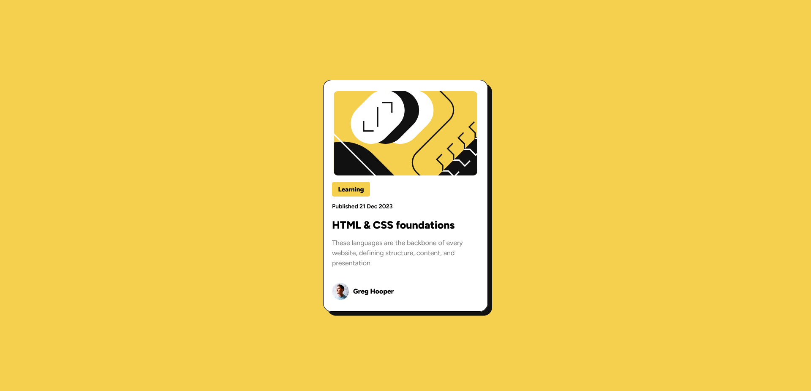

<h1>Projeto Blog Preview Card </h1> 

    Essa versão foi criada através do design disponibilizado pela plataforma. Você pode encontrar o mesmo na pasta design deste repositório

<h2> Exercício Proposto: 🕵️ </h2>

 
   Neste pequeno projeto, você construirá um card de visualização do blog.

<h2> Tecnologias Utilizadas: 👩‍💻 </h2>
  <ul> 
    <li>HTML5</li>
    <li>CSS3</li>
  </ul>

  <h2> Projeto Finalizado ✅ </h2>
  
 
Link do Projeto: <a href="https://g4breela.github.io/projeto-blog-preview-card/">https://g4breela.github.io/projeto-blog-preview-card/</a>

 
 
